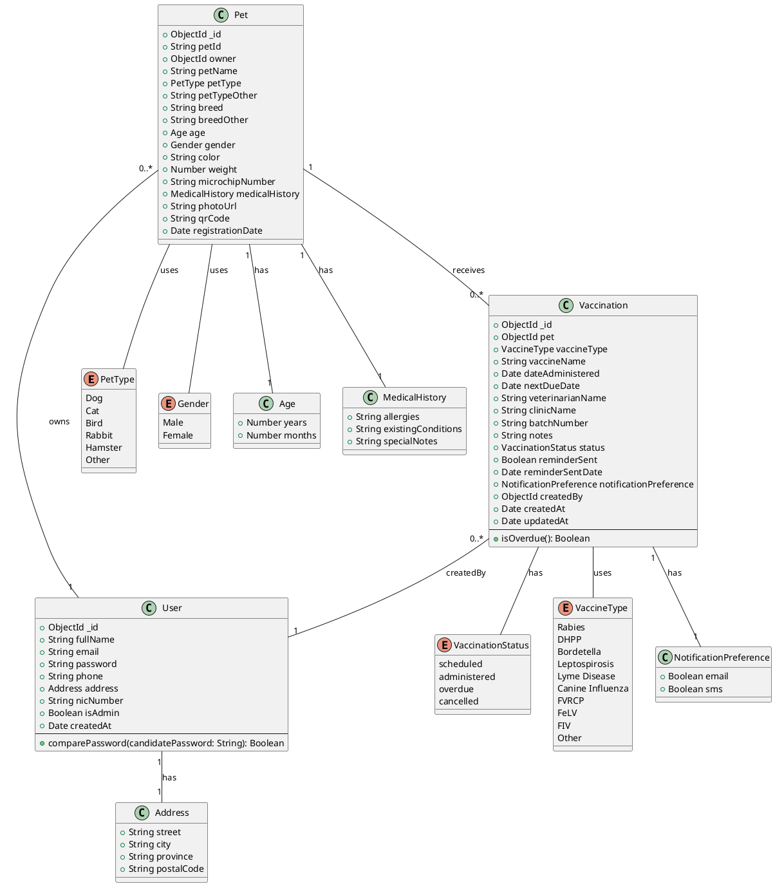

# Pet Vaccination & Stray Control System - UML Class Diagram

## Correct UML Representation (Based on Actual Implementation)

## Class Details

### User Class
**Attributes:**
- `_id`: ObjectId (MongoDB ID)
- `fullName`: String (required)
- `email`: String (required, unique, lowercase)
- `password`: String (required, hashed, min 6 chars)
- `phone`: String (required)
- `address`: Address (embedded document)
- `nicNumber`: String (required, unique)
- `isAdmin`: Boolean (default: false)
- `createdAt`: Date (auto-generated)

**Methods:**
- `comparePassword(candidatePassword: String): Boolean` - Compares provided password with hashed password

**Pre-save Hook:**
- Automatically hashes password before saving

---

### Address (Embedded in User)
**Attributes:**
- `street`: String (required)
- `city`: String (required)
- `province`: String (required)
- `postalCode`: String (required)

---

### Pet Class
**Attributes:**
- `_id`: ObjectId (MongoDB ID)
- `petId`: String (required, unique, auto-generated)
- `owner`: ObjectId (reference to User, required)
- `petName`: String (required)
- `petType`: PetType enum (required)
- `petTypeOther`: String (used when petType is "Other")
- `breed`: String (required)
- `breedOther`: String (used for custom breeds)
- `age`: Age (embedded document)
- `gender`: Gender enum (required)
- `color`: String (required)
- `weight`: Number (required, min: 0)
- `microchipNumber`: String (optional, sparse index)
- `medicalHistory`: MedicalHistory (embedded document)
- `photoUrl`: String (optional)
- `qrCode`: String (required, auto-generated)
- `registrationDate`: Date (auto-generated)

---

### Age (Embedded in Pet)
**Attributes:**
- `years`: Number (required, min: 0)
- `months`: Number (required, 0-11)

---

### MedicalHistory (Embedded in Pet)
**Attributes:**
- `allergies`: String (optional)
- `existingConditions`: String (optional)
- `specialNotes`: String (optional)

---

### Vaccination Class
**Attributes:**
- `_id`: ObjectId (MongoDB ID)
- `pet`: ObjectId (reference to Pet, required)
- `vaccineType`: VaccineType enum (required)
- `vaccineName`: String (required)
- `dateAdministered`: Date (required)
- `nextDueDate`: Date (required)
- `veterinarianName`: String (required)
- `clinicName`: String (optional)
- `batchNumber`: String (optional)
- `notes`: String (optional)
- `status`: VaccinationStatus enum (default: "administered")
- `reminderSent`: Boolean (default: false)
- `reminderSentDate`: Date (optional)
- `notificationPreference`: NotificationPreference (embedded)
- `createdBy`: ObjectId (reference to User)
- `createdAt`: Date (auto-generated)
- `updatedAt`: Date (auto-updated)

**Methods:**
- `isOverdue(): Boolean` - Virtual property to check if vaccination is overdue

**Indexes:**
- `pet + nextDueDate`
- `nextDueDate + status`
- `reminderSent + nextDueDate`

---

### NotificationPreference (Embedded in Vaccination)
**Attributes:**
- `email`: Boolean (default: true)
- `sms`: Boolean (default: false)

---

## Relationships

1. **User → Pet**: One-to-Many
   - One user can own multiple pets
   - Each pet belongs to one user (owner)

2. **User → Vaccination**: One-to-Many
   - Admin users can create vaccination records (createdBy)

3. **Pet → Vaccination**: One-to-Many
   - One pet can have multiple vaccination records
   - Each vaccination belongs to one pet

4. **User → Address**: One-to-One (Embedded)
   - Each user has one address
   - Address is embedded within User document

5. **Pet → Age**: One-to-One (Embedded)
   - Each pet has one age record
   - Age is embedded within Pet document

6. **Pet → MedicalHistory**: One-to-One (Embedded)
   - Each pet has one medical history
   - MedicalHistory is embedded within Pet document

7. **Vaccination → NotificationPreference**: One-to-One (Embedded)
   - Each vaccination has notification preferences
   - NotificationPreference is embedded within Vaccination document

---

## Key Features Not Shown in Original Diagram

1. **QR Code Generation**: Each pet automatically gets a unique QR code
2. **Password Hashing**: User passwords are automatically hashed using bcrypt
3. **Vaccination Reminders**: Automated system with scheduler (cron job)
4. **Vaccination Status Management**: Tracks scheduled, administered, overdue, and cancelled
5. **Medical History Tracking**: Comprehensive medical records for each pet
6. **Notification System**: Email/SMS preferences for vaccination reminders

---

## API Routes (Not in UML but part of system)

### Auth Routes (`/api/auth`)
- POST `/signup` - Register new user
- POST `/login` - User login
- GET `/me` - Get current user profile

### User Routes (`/api/users`)
- GET `/` - Get all users (admin only)
- GET `/:id` - Get user by ID (admin only)
- PUT `/:id` - Update user (admin or self)
- DELETE `/:id` - Delete user (admin only)

### Pet Routes (`/api/pets`)
- POST `/` - Register new pet (authenticated)
- GET `/` - Get all pets (admin only)
- GET `/user/:userId` - Get pets by user
- GET `/:petId` - Get pet by ID (public for QR code)
- PUT `/:petId` - Update pet (owner or admin)
- DELETE `/:petId` - Delete pet (owner or admin)

### Vaccination Routes (`/api/vaccinations`)
- POST `/` - Create vaccination record (admin only)
- GET `/pet/:petId` - Get vaccinations for pet
- GET `/:id` - Get vaccination by ID
- PUT `/:id` - Update vaccination (admin only)
- DELETE `/:id` - Delete vaccination (admin only)

---

## System Services

### Vaccination Scheduler
- Runs daily at 9 AM
- Checks for upcoming vaccinations (7 days before due date)
- Sends email reminders to pet owners
- Marks vaccinations as overdue if past due date

### QR Code Service
- Generates unique QR codes for each pet
- QR codes contain pet profile URL
- Accessible publicly for lost pet identification

---

## Notes
- All MongoDB ObjectIds are automatically generated
- Timestamps are managed by Mongoose for Vaccination
- Password comparison uses bcrypt
- JWT tokens used for authentication (7-day expiration)
- API uses JWT middleware for protected routes
- Admin role has elevated permissions for all operations
